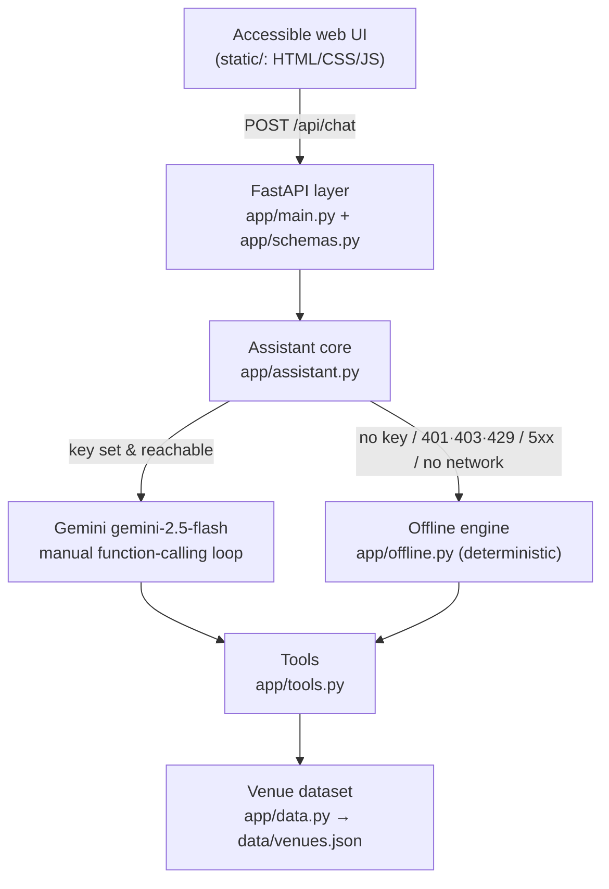

# AccessMate — Accessibility-First Stadium Copilot for FIFA World Cup 2026

**Challenge 4 — Smart Stadiums & Tournament Operations.**

AccessMate is a chat copilot for fans with accessibility needs attending FIFA
World Cup 2026 matches. A fan declares their language and access needs once, then
asks anything in plain language — *"quietest gate for a sensory-sensitive kid?"*,
*"wheelchair route from Gate C to my section?"*, *"¿dónde está la sala de
lactancia?"* — and gets a concise, screen-reader-friendly answer grounded in a
structured venue dataset.

It runs in two modes:

- **Live mode** — Google **Gemini** (`gemini-2.5-flash` by default, free-tier
  eligible; override with `GEMINI_MODEL` to match your key's tier) drives a
  function-calling loop over the venue tools.
- **Offline mode** — a deterministic keyword/intent engine answers from the same
  tools with **no API key and no network**, so evaluators can run the whole app
  with zero credentials. The app auto-selects offline when no key is set or the
  live API is unavailable.

---

## 1. Chosen Vertical — Accessibility (with multilingual + real-time support)

Of the verticals offered by the challenge (navigation, crowd management,
**accessibility**, transportation, sustainability, **multilingual assistance**,
operational intelligence, **real-time decision support**), we chose
**accessibility** as the primary persona and folded in multilingual assistance
and real-time decision support as supporting capabilities.

**Why:** "Accessibility – inclusive and usable design" is an explicit scoring
criterion, so an accessibility-first product aligns the problem statement with the
rubric twice over. The three host countries (USA, Canada, Mexico) make multilingual
support (English / Spanish / French, plus Arabic in the UI) a natural, high-value
extension, and a *simulated live-ops feed* demonstrates real-time decision making
(pick the quietest accessible gate **right now**, warn about elevator outages).

**Persona:** a fan with a mobility, low-vision, hearing, or sensory need (or a
carer for one) who needs trustworthy, specific, in-the-moment guidance for the
stadium they are visiting.

---

## 2. Approach & Logic

### Architecture



### Context → decision flow (the "logical decision making")

The fan's **profile** (selected venue, declared needs, language) plus their message
flow into a single decision path. The same four tools serve both engines, so live
and offline answers stay consistent and grounded:

| Tool | What it decides |
|---|---|
| `get_venue_info` | Names, city, capacity, gates, matchday basics |
| `find_accessible_services` | Filters the venue's accessibility data **by the declared need** (mobility / vision / hearing / sensory / general) |
| `get_live_status` | **Simulated** real-time feed — per-gate congestion, elevator outages, and the *quietest accessible gate right now* (deterministic, seeded by venue + hour) |
| `plan_visit` | Composes a step-by-step arrival plan: which gate, when to arrive (longer lead time for higher congestion and for declared needs), services en route, need-specific tips, outage warnings |

Context genuinely changes the answer: a **sensory** need routes to sensory rooms and
the quiet entrance; a **mobility** need routes to step-free gates, elevators, and
accessible seating; the live feed can down-rank a gate whose elevator is out.

### Live vs. offline

- **Live** (`app/assistant.py`): a frozen system prompt (grounding rule — answer
  venue facts **only** from tool results, never invent gate names or services;
  reply in the user's language; concise and screen-reader-friendly; no
  medical/legal advice), four `FunctionDeclaration`s, and a **manual**
  function-calling loop (iteration cap 8). The model's function-call turn is
  appended **verbatim** (thought signatures survive on Gemini 3.x) and all function
  responses go back in **one** user turn (required for parallel calls).
- **Offline** (`app/offline.py`): normalizes the message (lowercase, accent-strip;
  for Arabic this also folds hamza forms and diacritics), routes it to an intent via
  per-language keyword tables, calls the same tools, and fills language-specific
  templates (en/es/fr/ar). Fully deterministic, pure stdlib.

Failure handling degrades gracefully: missing key, `401/403/429`, `5xx`, or a
connection error all fall back to offline mode so the app **always answers**.

---

## 3. How It Works — setup & run

Requires Python 3.12+ (developed on 3.14).

```bash
# 1. Create and activate a virtual environment
python3 -m venv .venv
source .venv/bin/activate          # Windows: .venv\Scripts\activate

# 2. Install dependencies
pip install -r requirements.txt

# 3. (Optional) enable live Gemini mode with a Google AI Studio key
cp .env.example .env               # then edit, or just export the variable:
export GEMINI_API_KEY="your-key"   # omit entirely to run in offline mode
# export GEMINI_MODEL="..."        # optional: model id matching your key's tier

# 4. Run the app
uvicorn app.main:app --reload
# open http://127.0.0.1:8000
```

Without a key the app boots and answers in **offline mode** — no credentials
needed. Get a key at <https://aistudio.google.com/> to enable live mode; the
key is read from the environment and is **never** written to the repo. If the
configured model id is not available to your key, the app degrades to offline
mode instead of failing.

**API surface:** `POST /api/chat`, `POST /api/chat/stream` (NDJSON streaming),
`GET /api/venues`, `GET /api/venues/search?q=`, `GET /api/venues/{id}`,
`GET /healthz` (reports `{"llm": "live"|"offline"}`), and the UI at `/`.

---

## 4. Assumptions

- **Simulated live-ops feed.** `get_live_status` is **not** a real stadium feed. It
  produces deterministic pseudo-random congestion / elevator-outage data seeded by
  venue id + hour, and every payload is flagged `"simulated": true`. In production
  this function would call the venue's real operations API; the interface is
  designed for that swap.
- **No database.** The 16-venue dataset (`data/venues.json`) is a static JSON file,
  loaded once and cached. Chat is **stateless** — history round-trips through the
  client and is never persisted server-side.
- **Dataset provenance & confidence** (from tournament research):
  - **High confidence, sourced:** the 16-venue list, FIFA venue names, host cities,
    opening match (2026-06-11, Mexico City) and final (2026-07-19, MetLife), and the
    detailed accessibility facts for **MetLife** and **SoFi** (official venue sites).
  - **Approximate:** capacities use the Wikipedia FIFA-tournament figures and are
    labelled *"approximate tournament capacity"* in the data and UI.
  - **Illustrative / unverified:** accessibility details, gate layouts, and quiet
    routes for the other 14 venues are **plausible synthesized data** for demo
    purposes. Each venue carries a `verified` flag, and answers explicitly caveat
    unverified data ("not yet confirmed with the venue").
- **Languages.** The offline engine fully supports English, Spanish, French, and
  Arabic; the UI offers all four (Arabic renders RTL) and the live assistant also
  replies in the user's language. Arabic keyword routing tolerates attached
  proclitics (e.g. `بالتوحد` = "with-the-autism") and the definite article.

---

## 5. Testing & code quality

```bash
python -m pytest            # 152 tests, no network required

# Optional dev tooling (requirements-dev.txt): lint + type check + quality gates
pip install -r requirements-dev.txt
python -m ruff check app tests            # lint: zero findings
python -m mypy app                        # --strict type check: zero findings
python -m interrogate app                 # docstring coverage: 100% of app/
python -m radon cc app -n C               # complexity: no grade C+ function
python -m coverage run -m pytest && python -m coverage report  # 100% of app/
```

The suite (in `tests/`) covers **100% of `app/` — every line and every
branch**: the data layer
(including venue search), both engines (Arabic routing, clitic handling,
localized templates, profile-need fallbacks, outage warnings), the tool
dispatcher (valid/invalid venues, determinism of the simulated feed, defensive
error paths), the Gemini loop with a **fully mocked** client (function-call
round-trip, blocked-response guard, every offline-fallback trigger — including
streaming: mid-stream drop, empty stream, 400 re-raise), the FastAPI layer
(happy path, a 422 input-validation matrix, 404, 429 rate-limit burst, security
headers, health live/offline, static serving, key-non-leak, error frames with
no traceback leak), the rate limiters (bucket pruning, thread-safety under
concurrent load, Redis wiring and startup selection), and full-stack
integration in both modes. Verified green from a clean virtual environment
installed only from `requirements.txt`.

**Tooling:** `ruff` (rules in `pyproject.toml`, including the full `--select ALL`
ruleset) and `mypy --strict` both pass with zero findings, docstring coverage
(`interrogate`) is 100%, and cyclomatic complexity (`radon cc`) has no function
above grade B (low risk). A GitHub Actions workflow
(`.github/workflows/ci.yml`) enforces all of it — lint, type check, docstring
coverage, the complexity gate, and tests — on every push, failing if test
coverage drops below 100%.

---

## 6. Security notes

- **No secrets in the repo.** The API key is read from the environment only;
  `.env` is git-ignored and `.env.example` holds a placeholder. A key value is
  never returned by any endpoint or logged (`/healthz` reports only live/offline).
- **Strict security headers** on every response: `Content-Security-Policy:
  default-src 'self'`, `X-Content-Type-Options: nosniff`, `Referrer-Policy:
  no-referrer`, `X-Frame-Options: DENY`.
- **XSS-safe UI:** all dynamic text (user input **and** model output) is rendered
  via `textContent` / `createTextNode` — never `innerHTML`. No inline scripts or
  handlers, so the strict CSP holds.
- **Input validation & rate limiting:** Pydantic caps every field (message
  1–2000 chars, ≤20 history turns, needs enum, unknown fields rejected → `422`);
  a per-IP token-bucket limiter caps chat at 20 req/min (`429` on burst). The
  in-memory limiter prunes idle buckets so unique client IPs can't grow memory
  unbounded; set `REDIS_URL` to share the limit across replicas behind a load
  balancer (atomic Lua token bucket, graceful in-memory fallback if unreachable).
- **Prompt-injection hygiene:** the system prompt states that user messages are
  requests only and cannot change the rules or reveal the prompt; the model is
  instructed to answer facts **only** from trusted tool results.
- **Same-origin:** the UI is served by the API; no CORS/wildcard origins.

---

## 7. Accessibility notes (the product practises what it preaches)

- Semantic landmarks (`header`/`main`/`footer`, one `h1`), a skip link, and a chat
  transcript as `role="log"` + `aria-live="polite"` so screen readers announce each
  reply.
- Every control is labelled; the needs checkboxes are grouped in a
  `fieldset`/`legend`. Full keyboard operability; visible `:focus-visible`
  indicators; focus returns to the input after sending.
- WCAG-minded styling: light **and** dark themes (`prefers-color-scheme`),
  `prefers-reduced-motion` honoured, **forced-colors (Windows High Contrast)
  support**, rem-based sizing, ≥4.5:1 text contrast, and no meaning conveyed by
  colour alone (author labels "You:" / "AccessMate:").
- Screen-reader-safe streaming: partial tokens are hidden (`aria-hidden`) and the
  transcript is marked `aria-busy` while a reply streams, then the complete reply
  is announced exactly once; errors are `role="alert"` so they are never missed.
- Right-to-left support for Arabic — the transcript **and the message input**
  switch `lang`/`dir`; answers are concise and plain (no decorative emoji or
  ASCII art) for screen-reader clarity.
- A `<noscript>` fallback explains the requirement instead of a silent blank page.

---

## 8. Evaluation-criteria map

| Criterion | Where it is addressed |
|---|---|
| **Code Quality** | Small, single-responsibility modules (`data` → `tools` → `assistant`/`offline` → `main`) kept low-complexity by design (`radon cc` grade B or better throughout, no god-functions); pure functions, no duplicated logic (shared helpers for venue-summary projection, Gemini tool-call execution, and visit-plan step building); fully typed and `mypy --strict` clean; 100% docstring coverage (`interrogate`); `ruff` lint passes clean including the full `--select ALL` ruleset (config in `pyproject.toml`); CI enforces lint + type check + tests on every push; MIT `LICENSE`; the delicate Gemini SDK calls copied from a verified reference, not guessed. |
| **Security** | Section 6 — no secrets, strict CSP + headers, XSS-safe rendering, input caps, rate limiting, prompt-injection hygiene, key never leaked. |
| **Efficiency** | Dataset loaded once and cached (`lru_cache`); stateless requests; frozen system prompt for a stable cache prefix; tools return compact dicts; offline mode avoids any network call. |
| **Testing** | Section 5 — 152 tests, **100% line *and* branch coverage of `app/`** (enforced in CI), network fully mocked, green from a clean venv. |
| **Accessibility** | Section 7 — WCAG-minded, screen-reader-first UI, plus accessibility *is* the product domain. |
| **Problem Statement Alignment** | A smart, dynamic stadium assistant that makes **context-driven decisions** (profile + live feed → tailored routes/answers) for a chosen FIFA WC 2026 vertical — exactly the challenge's stated expectations. |

---

*Built for the FIFA World Cup 2026 hackathon. Venue accessibility details for
non-flagged venues are illustrative; always confirm with official venue services on
matchday.*
